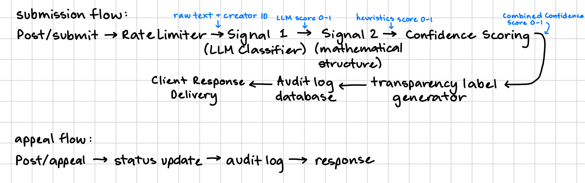

# Provenance Guard — planning.md

## Detection Signals

### Signal 1: Holistic LLM Classifier (Groq API)

**What it measures:**
This signal analyzes semantic flow, logical transitions, prompt-following patterns, and topical depth holistically

**Output format:**
A float value between 0.0 (confident human) and 1.0 (confident AI) parsed out from a structured JSON object returned by llama-3.3-70b-versatile model

**What it misses (Blind spots):**
Highly optimized, human-edited AI text or creative writing prompts that explicitly ask the model to adopt conversational imperfections or non-standard essay layouts

### Signal 2: Stylometric Heuristics Engine

**What it measures:**
This signal computes mathematical properties directly from the raw string: specifically, Type-Token Ratio (vocabulary diversity) and sentence length variance (burstiness).

**Output format:**
A float value between 0.0 (high variance/human) and 1.0 (high uniformity/AI), calculated by normalizing raw metrics against standard empirical baselines.

**What it misses (Blind spots):**
Highly structured human technical writing, legal drafts, or essays composed by non-native English speakers who naturally write with consistent sentence lengths and heavy transitional frameworks.

### Signal Combination & Fusion Logic

In standard operational boundaries where the signals broadly agree, the scores are combined using a weighted average: Final Score = (Signal 1 * 0.6) + (Signal 2 * 0.4).

However, to mitigate the false-positive problem, if the absolute difference between the two signals exceeds a conflict threshold, the system triggers a divergence rule. In this state, the system acknowledges high uncertainty and overrides the calculation, anchoring the final confidence score directly to a neutral 0.50.

## Uncertainty Representation

0.00 to 0.40 --> Likely Human-Written
0.41 to 0.75 --> Uncertain / Mixed Signals
0.76 to 1.00 --> Likely AI-Generated

**Testing Calibration:**
Calibration will be validated using four controlled benchmark items: and unedited machine-generated baseline, an informal human text, a rigid human academic text, and an AI output manually rewritten with casual variations. The scoring algorithm is successful only if clearly distinct files result in scores inside their target brackets.

## Transparency Label Design

| Classification Tier   | Target Score Bracket | Verbatim UX Label Display String                                                                                            |
|-----------------------|----------------------|-----------------------------------------------------------------------------------------------------------------------------|
| High-Confidence Human | 0.00 - 0.40          | Verified Authentic: This piece exhibits the structural variation and natural voice characteristic of human creation.        |
| Uncertain             | 0.41 - 0.75          | System Note: Unable to verify origin. The text displays a mix of structured patterns and organic language choices.          |
| High-Confidence AI    | 0.76 - 1.00          | AI Generated: Automated signatures detected. Content closely matches the structural profiles of language model generations. |

## Appeals workflow

**Eligibility & Submission:**
Any creator whose work receives a Likely AI-Generated status can initiate an appeal through the client application. They must provide a required text description detailing their specific background context or writing process, which is bundled into a Post/Appeal request along with the item's content_id.

**System State Transformations & Logging:**
The ingestion endpoint alters the file's indexed status from "classified" to "under_review" in storage.
The database audit log updates the corresponding record to bind the user's string reasoning and timestamps to the historical automated metrics.

**Human Reviewer Interface Queue:** 
A manual moderator opening the administrative queue will see a data table highlighting contested logs. Each row exposes the original content_id, submission text, individual signal outputs showing where the system conflicted, the user's typed defense justification, and action elements to either "Uphold Label" or "Override as Verified Human".

## Anticipated Edge Cases

**Edge Case 1 (Formal Human Academic Output):** 
A human research paper detailing complex scientific concepts. Because the vocabulary requires uniform domain terms and a highly formulaic structure, the local stylometric heuristic engine will register low burstiness and throw a high AI value, potentially overwhelming the model and generating an erroneous false positive.

**Edge Case 2 (Highly Repetitive Human Poetry):** 
A human-authored avant-garde poem relying heavily on repetitive refrains, short line fragments, and highly simplistic word choices. The mathematical metrics will calculate a compressed type-token ratio and minimal sentence variance, incorrectly flags it as automated text.

## Architecture

The text entry passes through an initial rate-limiting gatekeeper before flowing simultaneously to the holistic Groq LLM and the structural heuristics components. The confidence engine uses these individual evaluations to calculate a calibrated score, which the label component translates into explicit strings for end-users while writing transaction files directly into a structured database log. If a user contests the result, an independent appeal route locks the record under an audit state of "under_review" and escalates it to a priority console for human adjudication.

## AI Tool Plan

### Milestone 3: Submission Endpoint & First Detection Signal

**Spec Sections Provided:**
Detection Signals (Signal 1 Details), Architecture (Submission Diagram & Narrative)

**Generation Requests:**
Direct the assistant to construct the boilerplate Flask environment containing a functional Post/Submit router stub accepting JSON parameters (text, creator_id), alongside an isolated function executing a structured JSON-producing call to the Groq API utilizing llama-3.3-70b-versatile.

**Verification Protocol:**
Execute standalone script execution tests using static strings directly into the Groq connector. Once wired into the view, dispatch a mock curl payload to verify that the returned JSON outputs a generated unique text UUID (content_id), structural response slots, and successfully writes a basic log transaction.

### Milestone 4: Second Signal & Confidence Scoring

**Spec Sections Provided:**
Detection Signals (All Details), Uncertainty Representation, Architecture

**Generation Requests:**
Instruct the model to build an independent Python helper computing metrics for burstiness and type-token ratio without third-party mathematical wrappers. Request the creation of the fusion confidence algorithm that incorporates the conflict override safety check if individual returns diverge drastically.

**Verification Protocol:**
Evaluate the unified functions using the 4 explicit validation items. Verify that the system registers an expected mid-range value (0.50) when executing high-divergence cases, and ensure the local engine appends separate metrics alongside the primary index within the structured log entries.

### Milestone 5: Production Layer

**Spec Sections Provided:**
Transparency Label Design, Appeals Workflow, Architecture

**Generation Requests:**
Have the model write the operational lookup dictionary mapping numerical values directly to the verbatim text layout options. Then, have it construct the separate Post/Appeal endpoint that accesses the active data tables to update states and log strings.

**Verification Protocol:**
Submit valid inputs to assert that all three strings are reachable based on varying inputs. Pass a target ID sequence to the /appeal router, call the tracking log view using GET /log, and confirm the target entry contains the populated reasoning description alongside an "under_review" designation.